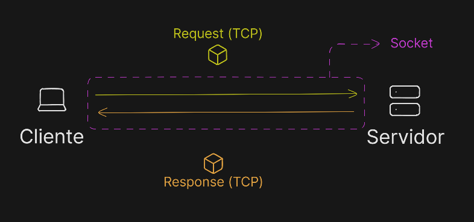

# UNIDAD 0

## INFRAESTRUCTURA BÁSICA

- **IP:** Dirección física de un dispositivo en la red.
- **Puerto:** Puertas de acceso a una IP.
- **TCP:** Servicio de mensajería que se encarga de enviar la información al destinatario.
- **Socket:** Conexión entre el cliente y el servidor por donde viajan los datos de forma continua.

- **DNS:** Traduce las ips a nombres más humanos.

## Protocolo HTTP/HTTPS

Funciona en un ciclo de Peticion (Request) y Respuesta (Response)
Un ciclo donde el cliente pregunta al servidor y este le responde.

Las peticiones HTTP:

- Línea de inicio: Verbo HTTP (Create (POST), Read (GET), Update (PUT/PATCH), Delete (DELETE)), URL/ruta, version HTTP
- Cabezeras: Metadatos clave-valor. Son contenido o tokens de seguridad.
- Cuerpo: Los datos reales que se envian, se pueden usar JSON. En caso de ser GET no suelen llevar cuerpo.

Las repuestas HTTP:

- Código de estado: `200 → OK`, `404 → No existe ruta`, `500 → Fallo en el servidor`
- Cabezera: Metadatos del servidor al cliente
- Cuerpo: Los datos pedidos o un mensaje de error.

