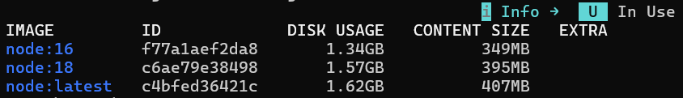

# UNIDAD 1

## TEORÍA DOCKER

- **Imagen:** Es el paquete estático (de solo lectura) que contiene el código de la App, las dependencias, las librerías y las herramientas del sistema necesarias para que funcione.
  - Se construyen mediante una acumulación de **capas**.
  - Es la "plantilla" o la "receta" que se comparte con el equipo.
  
- **Contenedor:** Es una instancia en ejecución de una imagen.
  - Cuando "enciendes" o ejecutas una imagen, se convierte en un contenedor.
  - Es un entorno aislado donde la aplicación realmente vive y funciona.

- **Registro / Repositorio:** Es el lugar en la nube donde se guardan y comparten las **imágenes** (como Docker Hub). Pueden ser públicos o privados.

- **Solución a problemas:** Acaba con el clásico problema de *"en mi máquina sí funciona"*. Al estar todo empaquetado en la imagen, evitamos conflictos de versiones en lenguajes, dependencias o incompatibilidades con el Sistema Operativo donde se vaya a desplegar.

## DOCKER DESKTOP

- Es una VM que funciona en Linux y ejecuta containers.
- Accede al sistem de archivos y a la red privada o pública
- Posee Docker Compose y CLI y otras herramientas.
- Funciona en Windows gracias a WSL2 (Windows System For Linux)

## COMANDOS IMAGENES

- `docker images` → Muestra las imagenes descargadas/creadas.

- `docker pull <image>` → Descagar imagen.
  -Ejemplo: `docker pull node:18` → Descagar la imagen de Node 18, si no ponemos versión, instala la última
- `docker image rm <image>` → Borra una imagen

## COMANDOS CONTENEDORES

Para crear un contenedor vamos a necesita una imagen.

- `docker create <image>` → Crea un contenedor a partir de una imagen, dando como resultado un ID.
- `docker create --name <nombre> <image>` → Crea un contenedor con un nombre y a partir de una imagen

- `docker start <ID|name>` → Inicia el contenedor creado.
- `docker stop <ID|name>` → Detiene un contenedor.
- `docker rm <ID|name>` → Elimina el contenedor.

- `docker ps` → Muestra los contenedores iniciados.
- `docker ps -a` → Muestra todos los contenedores iniciados y no iniciados

- `docker logs <ID|name>` → Muestra los logs del contenedor
- `docker logs --follow <ID|name>` → Muestra los logs en tiempo real del contenedor.

### PORT MAPPING

- `docker create -p<portPC>:<portContainer> --name <name> <image>` → Mapeamos el puerto del PC real (lado izquierdo)
al puerto interno del contenedor (lado derecho).

## COMANDO `DOCKER RUN`

Este comando agrupa 3 pasos en 1: Encuentra/descarga la imagen, crea el contenedor y lo inicia.

- `docker run <image>`→ Hace los 3 pasos y finaliza mostrando los logs en vivo (bloquea terminal).
- `docker run -d <image>`→ Se ejecuta en segundo plano y te devuelve el control de la terminal.
- `docker run --name <name> -p<portPC>:<portContainer> -d <image>` → En segundo plano, con nombre, con puertos mapeados y a partir de una imagen.

## CREAR IMAGENES PROPIAS

- `docker build -t <name_image>:<etiqueta> <ruta_DockerFile>` → Crea una imagen a partir de las instrucciones de un archivo llamado `Dockerfile`.

### DOCKER NETWORK

Los contenedores están aislados. Permite la comunicación entre contenedores.

- `docker network ls` → Muestra las redes internas de docker.
- `docker network create <name_red>` → Crea una red interna nueva.
- `docker network rm <name_red>` → Borra una red.
- `docker run -d --name <name> -p <portPC>:<portContainer> --network <name_red> <image>` → Inicia un contenedor conectándolo directamente a la red interna que hemos creado.

## DOCKER COMPOSE

Herramienta que nos permite definir y ejecutar aplicaciones Docker de múltiples contenedores usando un archivo YAML (`docker-compose.yml`).

- `docker compose up` → Lee el archivo, crea las redes/volúmenes y levanta todos los contenedores mostrando los logs en vivo.
- `docker compose up -d` → Igual que el anterior, pero en segundo plano (Detached). Te devuelve el control de la terminal.
- `docker compose down` → Apaga y destruye todos los contenedores y redes creadas por el `up`.

### MULTIPLES ENTORNOS (Dev vs Prod)

En proyectos reales, solemos tener diferentes configuraciones dependiendo de si estamos programando en nuestro PC o si la web ya está en internet.

- **`docker-compose-dev.yml`**: Configuración para Desarrollo (Development). Optimizado para el programador (puertos abiertos, recarga en caliente, muestra errores).
- **`docker-compose-prod.yml`**: Configuración para Producción (Production). Optimizado para el usuario final (seguridad máxima, rendimiento, puertos internos cerrados).

**¿Cómo ejecutamos un archivo con un nombre distinto al por defecto?**
Usamos la bandera `-f` (file) para indicarle el nombre exacto:
`docker compose -f docker-compose-dev.yml up -d`

## VOLÚMENES (PERSISTENCIA DE DATOS)

Los contenedores son **efímeros**. Esto significa que, por defecto, si borras o destruyes un contenedor, **todos los datos que se generaron en su interior se pierden para siempre** (por ejemplo, los registros de una base de datos).

Para solucionar esto usamos **Volúmenes**. Un volumen es básicamente una carpeta segura en nuestro ordenador real que se "conecta" como un túnel a una carpeta dentro del contenedor. Así, aunque el contenedor se destruya, los datos siguen a salvo en nuestro disco duro y pueden ser usados por un contenedor nuevo.

### ESTRUCTURA BASE DE UN PROYECTO (DOCKER COMPOSE + DOCKERFILE)

Para mantener el orden en proyectos reales (como uno de PHP + MySQL), lo ideal es tener el archivo `.yml` en la raíz y separar las configuraciones a medida en carpetas.

**Estructura de carpetas recomendada:**

~~~text
mi_proyecto/
 ├── docker-compose.yml    <-- En la raíz (para hacer el "up" fácilmente)
 ├── docker/               
 │    └── php/
 │         └── Dockerfile  <-- Instrucciones para crear nuestra imagen de PHP a medida
 └── src/                  
      └── index.php        <-- Nuestro código fuente
~~~

**Estructura de un DockerFile:**

Algunas imagenes oficiales no contiene todo lo necesario, por eso usamos este archivo.

~~~dockerfile
# 1. Partimos de la imagen oficial de PHP con un servidor Apache incluido
FROM php:8.2-apache

# 2. Ejecutamos un comando dentro de la imagen para instalar las extensiones de MySQL
RUN docker-php-ext-install mysqli pdo pdo_mysql
~~~

**Estructura de un Docker-compose-dev:**

~~~yml
version: "3.9"

services:

  # SERVICIO 1: Nuestro servidor web con PHP (Imagen a medida)
  php_web:
    # En lugar de 'image', usamos 'build' y le damos la ruta hacia la carpeta de nuestro Dockerfile
    build: 
      context: ./docker/php
      dockerfile: Dockerfile.dev # Aquí tendrías que avisarle del nuevo nombre
    ports:
      - "8080:80" # Entramos por localhost:8080 en nuestro PC
    volumes:
      # Conectamos nuestra carpeta 'src' (donde está el código) a la carpeta pública del Apache en el contenedor
      - ./src:/var/www/html 
    depends_on:
      - base_datos # Espera a que MySQL arranque primero

  # SERVICIO 2: Nuestra base de datos (Imagen oficial)
  base_datos:
    image: mysql:8.0 # Descarga esta imagen directamente
    ports:
      - "3306:3306"
    environment:
      - MYSQL_ROOT_PASSWORD=mi_password_secreta
      - MYSQL_DATABASE=mi_base_de_datos # Crea esta BBDD automáticamente al arrancar
    volumes:
      - mysql_datos:/var/lib/mysql # Guarda los datos en el volumen definido abajo

# Declaración del volumen para que los datos de MySQL no se borren
volumes:
  mysql_datos:
~~~
