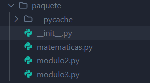

# TEMA 3

## FUNCIONES

Declaramos funciones con `def` y dentro de las funciones podemos retornar o no  
un valor con `return`. También, las funciones pueden recibir o no parámetros.  
Y llamamos a una función con `nombreFunction()`  

~~~python
def sumar(a, b):
    return a + b

print(sumar(4,2)) #Llamada función
~~~

Además en python es posible con `return` retornar más de un valor.  
Y podemos guardarlos o usarlos en variables.

~~~python
def dividir(dividendo, divisor):
    cociente = dividendo // divisor
    resto = dividendo % divisor
    return cociente, resto

c, r = dividir(12, 4)
print(f"División entre 12 y 4: Cociente: {c}, Resto: {r}")
~~~

Es posible establecer un valor por defecto del parámetro de una función.  
Entonces sí ese parámetro no se define, tomará el valor por defecto de la función.

~~~python
def saludar(nombre, apellido, curso="2DAW"):
    print(f"Hola {nombre} {apellido} alumno/a de {curso}")

saludar("Alicia", "Sánchez") # Por defecto pondra 2DAW
~~~

También una función puede llamar a otra función.

~~~python
def exito(msg):
    print(f'{msg}. Yeah!')

def hazlo(funcion, argumentos_funcion):
    funcion(argumentos_funcion) # exito(msg)

hazlo(exito, 'Funciones como parmetros')
~~~

En las funciones podemos especificar que tipo de dato es.

~~~python
def dividir(dividendo:float, divisor:float | int):
    cociente = dividendo // divisor
    resto = dividendo % divisor
    return cociente, resto

c, r = dividir(12, 4)
print(f"División entre 12 y 4: Cociente: {c}, Resto: {r}")
~~~

## MODULOS

En python podemos modularizar el código.  
Para ello creamos archivos con ficheros y los llamamos con `import`  

Podemos importar un módulo completo con `import`  

- Usando `as` podemos ponerle un alias al módulo.

Con `from modulo import func` podemos importar partes del módulo.  
Llamamos al módulo colocando el nombre del módulo y la función que vamos a usar de ese módulo.
    sysconfig.get_config_h_filename()

## PAQUETES

Para crear paquetes creamos una carpeta que va a contener los módulos y el archivo `__init__.py`
Este archivo se encarga de convertir una carpeta en un paquete  
Los paquetes tienen esta estructura:  

Luego el archivo `__init__.py` recibe los `import` de los otros archivos creando el paquete.  
Podemos importar el módulo completo con `.` o solo parte del módulo.  

- Ejemplo: Carpeta llamada **paquete**

~~~python
# archivo: __init__.py
from . import modulo1
from . import modulo2
from modulo3 import multiplicacion

__all__ = ["multiplicacion"]
~~~

Para usar ese paquete solo tenemos que importar la carpeta al archivo que vamos a usar.  

- **Paquete completo**

~~~python
# archivo: main.py
import paquete

paquete.suma(2, 3)
paquete.multiplicacion(4, 3)
~~~

- **Paquete parcial**

~~~python
# archivo: main.py
from paquete import suma, multiplicacion

suma(2, 3)
multiplicacion(4, 3)
~~~

- **Paquete con \_\_all__**
  
`__all__` solo funciona al hacer `import *` y evita que importemos lo que no este controlado por `__all__`

~~~python
# archivo: main.py
from paquete import *

multiplicacion(2,3) #Funciona
resta(5,2) # Nofunciona
~~~

## ENTORNOS VIRTUALES

Un entorno virtual es un entorno aislado de Python que permite instalar  
y usar paquetes s de un proyecto sin afectar al al resto de archivos o carpetas.

### COMANDOS INICIALES

Para cualquier comando usamos `py -m pip` (relacionado con pip)  
`py -m pip --version` > Ver versión.  
`py -m pip list` > Mostrar paquetes instalados.  
`py -m pip show "nombre paquete"` > Ver informacion sobre ese paquete  

### CREAR ENTORNO VIRTUAL

1. Creamos y nos metemos en esa carpeta (terminal).  
2. Crear un entorno virtual en esa carpeta: `py -m venv .venv`  
3. Observamos que se ha creado dentro una capeta con más carpetas como include, lin, scripts...  
4. Activar el entorno (Una cosa es crearlo y otra activarlo): `.\.venv\Scripts\Activate.`ps1 (powershell)  
5. En terminal nos sale `(.venv)`, es decir estamos dentro del entorno virtual.

### INSTALAR UN PAQUETE

1. `py -m pip install "nombre paquete"`
2. Vemos que se ha instalado y creamos en la carpeta , para ejecutar el archivo usamos el comando `py nombre_archivo.py`
3. Desinstalar > `py -m pip uninstall "nombre_paquete"`  
4. Para salir usamos `deactivate`  
5. Borrar el entorno virtual > `rm -R .venv`  
